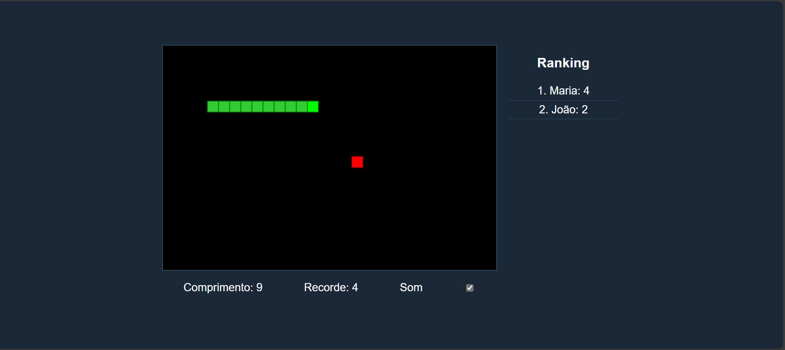

# Snake Game

[](https://opensource.org/licenses/MIT)

Este projeto é um jogo da cobrinha (Snake Game) construído utilizando HTML, CSS e JavaScript. O objetivo do jogo é controlar a cobrinha para coletar comida, crescer de tamanho e evitar colidir com as bordas ou com o próprio corpo.

## Funcionalidades

- Controle da cobrinha usando as teclas de seta do teclado.
- Sistema de pontuação que exibe o comprimento atual da cobrinha.
- Armazenamento e exibição do recorde de pontuação usando `localStorage`.
- Ranking dos 10 melhores jogadores com armazenamento local.
- Som ao coletar comida.
- Interface amigável com suporte a modo escuro e claro.

## Tecnologias Utilizadas

- HTML para a estrutura do jogo.
- CSS para estilização.
- JavaScript para a lógica do jogo.
- GitHub para versionamento e hospedagem do código.

## Instalação

Para instalar e executar este projeto localmente, siga estas etapas:

1. Clone o repositório:

    ```bash
    git clone https://github.com/seu-usuario/snake-game.git
    ```

2. Navegue até o diretório do projeto:

    ```bash
    cd snake-game
    ```

3. Abra o arquivo `index.html` no seu navegador web.

## Uso

Para iniciar o jogo, simplesmente abra o arquivo `index.html` no seu navegador preferido. Use as setas direcionais para mover a cobrinha e comece a jogar!

## Contribuição

Contribuições para o projeto são bem-vindas! Para contribuir, por favor, siga estas etapas:

1. Fork o repositório.
2. Crie uma nova branch com um nome descritivo para a nova funcionalidade ou correção.
3. Faça suas alterações.
4. Envie um pull request detalhando as mudanças propostas.

## Licença

Este projeto está licenciado sob a Licença MIT - veja o arquivo [LICENSE](LICENSE) para detalhes.

## Deploy

A aplicação está disponível para teste em [https://seu-usuario.github.io/snake-game](https://seu-usuario.github.io/snake-game)

## Captura de Tela

### Tela do Jogo

